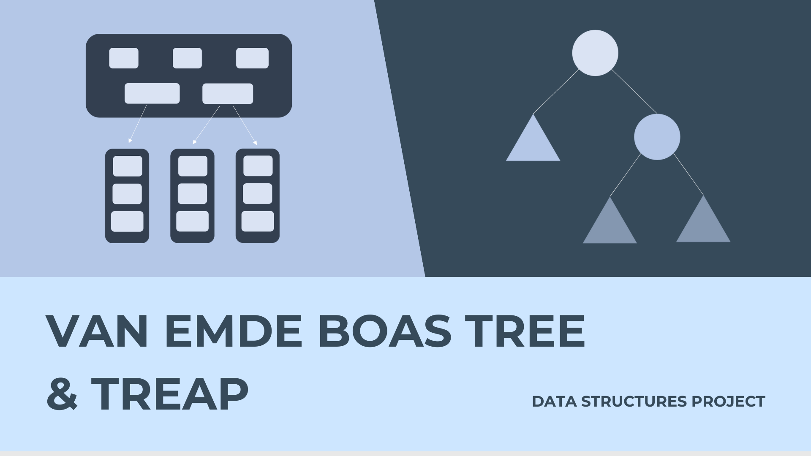

## Project Description

This project aims to implement the van Emde Boas Tree and Treap data structures and their operations, and also aims to analyze their potential use case scenarios.

Submission for CIA-2 for the Data Structures Course - CS1006T.

## Video Explanation

[](https://www.youtube.com/watch?v=szGnCc3TdcA "van Emde Boas Tree and Treap | Data Structures")

## Accessing Documentation

The documentation (Requirement, Presentation, etc.) can be found in the **docs** folder.

[Animated Presentation](docs/Presentation_animated.ppsx) - Explains the design, algorithm and working of the data structures, with animated diagrams.

[Presentation](docs/Presentation.pdf) - Explains the design, algorithm and working of the data structures.

[Requirement Document](docs/Requirements.pdf) - Copy of the requirement document provided to the developers earlier during development.

## How to run

It is required that your system has the following compilers installed - **_gcc, g++_**

Go to the directory containing the file and run the following commands on the Terminal:

```
g++ <filename>.cpp
```

Then,

On Linux/Mac:

```
./a.out
```

On Windows:

```
./a.exe
```

## Citations

- [Treaps – Complete Introduction by Uzair Javed Akhtar](https://www.youtube.com/watch?v=ZNtC4oUaQ8A)
- [Treap – A randomized BST by Geeks4Geeks](https://www.geeksforgeeks.org/treap-a-randomized-binary-search-tree/)
- [Divide & Conquer – van Emde Boas Tree by Eric Demaine](https://ocw.mit.edu/courses/6-046j-design-and-analysis-of-algorithms-spring-2015/resources/lecture-4-divide-conquer-van-emde-boas-trees/)
- [van Emde Boas Trees by Sam McCauley](https://williams-cs.github.io/cs358-f21/lectures/lecture23/veb.pdf)

## Team

### Managers

- [Ramana K S](https://www.github.com/Ignia707) - Project Manager
- [Prajesh Raam H S](https://www.github.com/hotaru-hspr) - Business Analyst

### Developers

- [Saran Shankar R](https://www.github.com/try3d)
- [Nikhilesh H](https://www.github.com/Nikhilesh-H)
- [Prem Danasekaran](https://www.github.com/Black-Hawk-005)
- [Nighil Natarajan](https://www.github.com/nighil05)
- [Raghav Sridharan](https://www.github.com/raghavsridharan)

### Testers

- [Sathya Narayanan](https://www.github.com/Sathya4683)
- [Sanjeev Krishna S](https://www.github.com/sanjeevkrishna2114)
- [Nithilan M](https://www.github.com/MadeForMoney)
